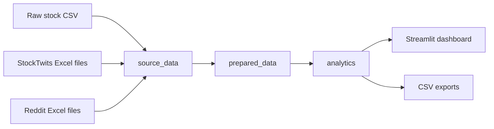
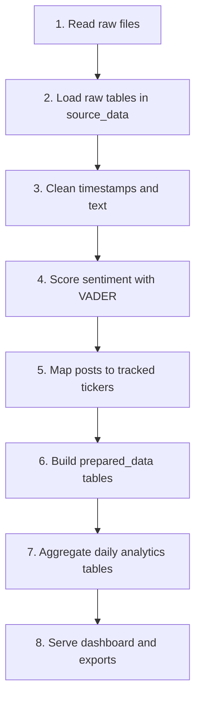
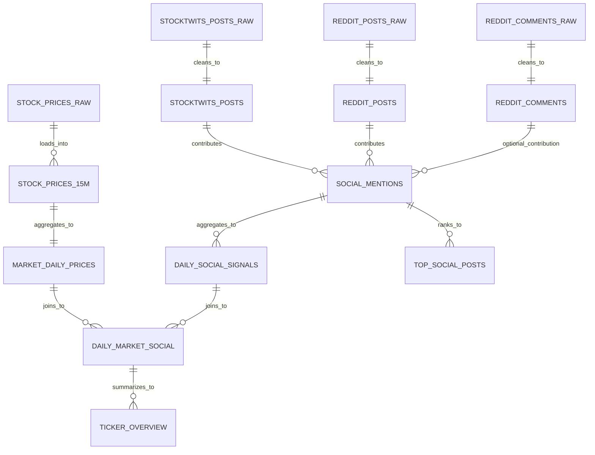
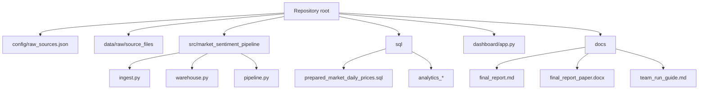
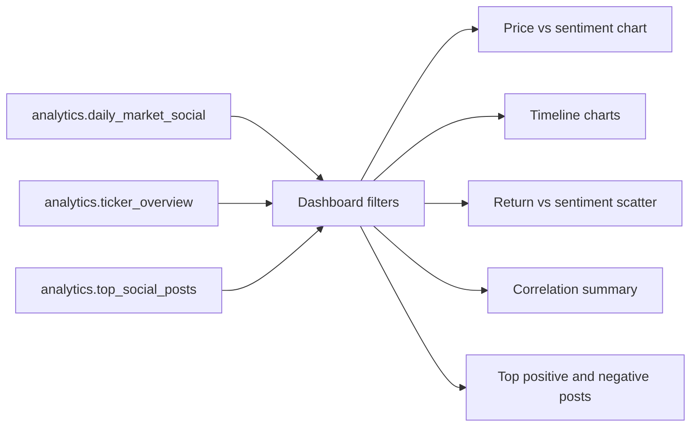

# MarketMood

MarketMood is our data engineering project on stock price movement and social sentiment.

The idea is simple: we wanted one place where we could look at market data and social discussion together instead of treating them as two separate things. The project takes stock prices, Reddit posts, and StockTwits posts, cleans them up, stores them in DuckDB, and turns them into a dashboard that compares price movement with sentiment.

## What is in this repo

This repository already includes the raw source files, so teammates do not need to hunt them down separately.

Raw files live here:

- `data/raw/source_files/stocks/`
- `data/raw/source_files/stocktwits/`
- `data/raw/source_files/reddit/`

The project then builds three layers in DuckDB:

- `source_data` for the raw loaded tables
- `prepared_data` for cleaned and transformed tables
- `analytics` for the final dashboard and reporting tables

## System design at a glance



## ETL flow



## Schema overview



## Repository structure



## What the project tries to answer

- Do social discussions line up with stock price movement?
- Which stocks get the most attention on Reddit and StockTwits?
- Does positive or negative sentiment seem to relate to same-day or next-day returns?

## Data included

The repo currently includes:

- 15-minute stock bars for 8 tickers
- 8 StockTwits workbooks
- 8 monthly Reddit workbooks

Observed scale:

- stock rows: `151,852`
- StockTwits posts: `1,310,301`
- Reddit posts: `14,658`
- Reddit comments: `518,592`

## Main files

- [raw_sources.json](C:/Users/dings/OneDrive/Documents/New%20project/config/raw_sources.json): tells the pipeline where to find the raw files
- [run_pipeline.py](C:/Users/dings/OneDrive/Documents/New%20project/run_pipeline.py): runs the ETL
- [app.py](C:/Users/dings/OneDrive/Documents/New%20project/dashboard/app.py): Streamlit dashboard
- [team_run_guide.md](C:/Users/dings/OneDrive/Documents/New%20project/docs/team_run_guide.md): step-by-step setup for teammates
- [project_design.md](C:/Users/dings/OneDrive/Documents/New%20project/docs/project_design.md): report-style explanation of the project
- [raw_storage_design.md](C:/Users/dings/OneDrive/Documents/New%20project/docs/raw_storage_design.md): explanation of raw storage and refined storage
- [final_report.md](C:/Users/dings/OneDrive/Documents/New%20project/docs/final_report.md): paper-style final report for submission
- [final_report_paper.docx](C:/Users/dings/OneDrive/Documents/New%20project/docs/final_report_paper.docx): Word version of the paper-style report

## How to run it

The short version is:

```powershell
python -m venv .venv
.venv\Scripts\Activate.ps1
pip install -r requirements.txt
python run_pipeline.py
streamlit run dashboard/app.py
```

If you want the full teammate-friendly version, use:

- [team_run_guide.md](C:/Users/dings/OneDrive/Documents/New%20project/docs/team_run_guide.md)

## What the dashboard shows

The final UI focuses on stock price versus sentiment. It includes:

- price trend by ticker
- sentiment trend over time
- a combined price-vs-sentiment view for one selected ticker
- sentiment vs next-day return scatter plot
- correlation summary by ticker
- top positive and negative posts for demo purposes

## Dashboard logic



## Project structure

```text
.
|-- config/
|   `-- raw_sources.json
|-- dashboard/
|   `-- app.py
|-- docs/
|   |-- final_report.md
|   |-- final_report_paper.docx
|   |-- presentation_outline.md
|   |-- project_design.md
|   |-- raw_storage_design.md
|   `-- team_run_guide.md
|-- data/
|   `-- raw/
|       `-- source_files/
|           |-- stocks/
|           |-- stocktwits/
|           `-- reddit/
|-- sql/
|   |-- analytics_daily_market_social.sql
|   |-- analytics_daily_social_signals.sql
|   |-- analytics_dataset_inventory.sql
|   |-- analytics_ticker_overview.sql
|   |-- analytics_top_social_posts.sql
|   `-- prepared_market_daily_prices.sql
|-- src/
|   `-- market_sentiment_pipeline/
|       |-- config.py
|       |-- ingest.py
|       |-- pipeline.py
|       `-- warehouse.py
|-- tests/
|   `-- test_pipeline.py
|-- requirements.txt
`-- run_pipeline.py
```

## Why we designed it this way

- The repo includes the real data, so the project is easier to reproduce.
- DuckDB keeps the setup lightweight for a class project.
- The layer split makes it easier to explain the flow during presentation.
- The dashboard reads from curated analytics tables instead of messy raw files.

## For the report

If you are working on the written report, start with:

- [project_design.md](C:/Users/dings/OneDrive/Documents/New%20project/docs/project_design.md)
- [raw_storage_design.md](C:/Users/dings/OneDrive/Documents/New%20project/docs/raw_storage_design.md)
