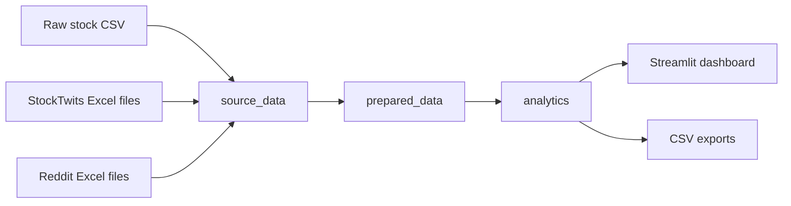

# MarketMood: Integrating Stock Prices with Social Sentiment for Market Analysis

## Abstract

This project explores whether social sentiment and stock price movement can be studied together in a practical data engineering workflow. We built a pipeline that combines 15-minute stock price data with StockTwits posts and Reddit discussions for eight technology-related tickers: `AAPL`, `AMD`, `GOOG`, `GOOGL`, `META`, `MSFT`, `MU`, and `NVDA`. The raw data is loaded into DuckDB, cleaned into a refined layer, and aggregated into analytics tables that feed a Streamlit dashboard. The final system supports both technical evaluation and business-style exploration by showing price movement, social activity, average sentiment, and simple correlation measures in one place. The results suggest that social attention is highly uneven across tickers, that same-day sentiment tends to have a weak positive relationship with return, and that next-day relationships are much noisier. Overall, the project shows that sentiment is useful as a contextual feature, even if it is not a strong standalone trading signal.

## 1. Introduction

Stock prices and online discussion are often studied separately. Market data is structured, numeric, and easy to chart. Social media data is informal, noisy, and much harder to interpret at scale. In practice, however, many traders and analysts look at both. A sharp move in a stock is often discussed on Reddit or StockTwits, and strong online sentiment can influence how market participants interpret news, momentum, and risk.

The goal of this project was to build a small but realistic data platform that brings those two worlds together. Instead of creating a notebook with a few charts, we designed an end-to-end workflow: raw data storage, ingestion, transformation, analytics-ready tables, and a final user interface. This keeps the project grounded in data engineering rather than only in analysis.

The finished system allows us to answer a few practical questions:

1. Which tickers receive the most social attention?
2. How does average daily sentiment compare with same-day return?
3. Does daily sentiment have any noticeable relationship with next-day return?
4. Which positive or negative posts stand out in the underlying data?

## 2. Problem Statement

Looking only at stock prices tells us what happened, but not how market participants were reacting at the same time. Looking only at social posts tells us what people were saying, but not whether that discussion lined up with actual market movement. For a final project, this creates a useful engineering problem: how do we combine structured market data and unstructured social text in a way that is reproducible, queryable, and easy to present?

We therefore defined the problem as building a local analytics platform that:

- ingests raw stock and social data from different file formats
- preserves the original source files in a reproducible way
- transforms the data into a consistent warehouse model
- computes sentiment signals from text
- supports a final dashboard that compares stock price and sentiment over time

## 3. Project Objectives

The project has four main objectives.

First, it should demonstrate a proper data engineering workflow rather than only a notebook analysis. That means clear source storage, ETL logic, refined tables, and a serving layer.

Second, it should use a realistic dataset size. In this project, the data volume is large enough to justify warehouse design choices and not just ad hoc scripting.

Third, it should produce interpretable outputs. The final dashboard and report should let a reader understand how price, sentiment, and attention interact.

Fourth, it should remain easy for teammates to reproduce. For that reason, the raw files are stored directly in the repository and the project can be run locally with Python and DuckDB.

## 4. Dataset Description

The project uses three main data sources.

### 4.1 Stock price data

The market dataset is a CSV file containing 15-minute OHLCV bars. It covers the period from January 2, 2025 to March 19, 2026, with AAPL starting slightly later on February 3, 2025. The columns are:

- `timestamp`
- `Ticker`
- `Open`
- `High`
- `Low`
- `Close`
- `Volume`

Observed raw row count:

- `151,852`

### 4.2 StockTwits data

The StockTwits data is stored as eight Excel workbooks, one per ticker. Each workbook includes posts with the following fields:

- `post_id`
- `user`
- `time`
- `content`

Observed raw row count:

- `1,310,301`

### 4.3 Reddit data

The Reddit data is stored as monthly Excel workbooks from `2025-08` to `2026-03`. Each workbook includes three sheets:

- `Posts`
- `Comments`
- `Summary`

Observed raw row counts:

- Reddit posts: `14,658`
- Reddit comments: `518,592`
- Reddit summary rows: `56`

### 4.4 Why the dataset is suitable

This dataset is practical for a course project for three reasons. First, it is already collected, so the project can focus on engineering and analytics instead of scraping. Second, it combines structured and unstructured data, which makes the ETL design meaningful. Third, it is large enough to support a layered storage design without becoming too large for a local workflow.

## 5. System Architecture

The project follows a simple warehouse architecture built around DuckDB.

The main design decision was to keep the stack lightweight and reproducible. DuckDB was chosen because it works well for local analytics, integrates cleanly with Python and Pandas, and does not require separate server management. Streamlit was chosen for the final application because it makes it easy to present the project interactively.

## 6. Raw Storage Design

The raw source files are stored directly inside the repository under:

- `data/raw/source_files/stocks/`
- `data/raw/source_files/stocktwits/`
- `data/raw/source_files/reddit/`

The file [raw_sources.json](C:/Users/dings/OneDrive/Documents/New%20project/config/raw_sources.json) acts as the manifest that tells the pipeline where to find those sources.

This design has two advantages:

1. Teammates can run the project without copying files from external folders.
2. The ETL remains reproducible because the input paths are explicitly defined.

The raw files are then loaded into the `source_data` schema in DuckDB:

- `source_data.stock_prices_raw`
- `source_data.stocktwits_posts_raw`
- `source_data.reddit_posts_raw`
- `source_data.reddit_comments_raw`
- `source_data.reddit_summary_raw`

At this stage, the goal is not analysis. The goal is to keep the raw structure as intact as possible while attaching minimal metadata such as source file name, source ticker, or source month.

## 7. ETL Process

The ETL pipeline is implemented in [ingest.py](C:/Users/dings/OneDrive/Documents/New%20project/src/market_sentiment_pipeline/ingest.py), [warehouse.py](C:/Users/dings/OneDrive/Documents/New%20project/src/market_sentiment_pipeline/warehouse.py), and the SQL files under [sql](C:/Users/dings/OneDrive/Documents/New%20project/sql).

### 7.1 Extract

The extraction step reads:

- the stock CSV with `pandas.read_csv`
- the StockTwits workbooks with `pandas.read_excel`
- the Reddit workbooks by reading the `Posts`, `Comments`, and `Summary` sheets

### 7.2 Transform

The transformation step handles both market and social data.

For market data, the pipeline:

- standardizes ticker names
- parses timestamps
- casts price and volume fields into numeric types
- rolls 15-minute bars into daily OHLCV using SQL

For social data, the pipeline:

- standardizes text and user fields
- parses timestamps from both string and Excel-style formats
- computes sentiment scores using VADER
- assigns sentiment labels
- maps posts to tracked tickers using file context, cashtags, keywords, and aliases
- builds a unified `prepared_data.social_mentions` table

### 7.3 Load

The cleaned tables are stored in the `prepared_data` schema:

- `prepared_data.stock_prices_15m`
- `prepared_data.market_daily_prices`
- `prepared_data.stocktwits_posts`
- `prepared_data.reddit_posts`
- `prepared_data.reddit_comments`
- `prepared_data.social_mentions`

The final reporting layer is stored in the `analytics` schema:

- `analytics.daily_social_signals`
- `analytics.daily_market_social`
- `analytics.ticker_overview`
- `analytics.top_social_posts`
- `analytics.dataset_inventory`

### 7.4 Data quality rules

The pipeline applies a few simple quality checks and assumptions:

- malformed timestamps are filtered out
- invalid or missing core market rows do not enter the final daily market table
- sentiment scores are bounded by the VADER model range of `[-1, 1]`
- social rows without an inferred ticker are excluded from the final analytics layer

## 8. Refined Storage and Analytics Design

The refined warehouse design follows three logical steps:

- `source_data` keeps the raw input structure
- `prepared_data` standardizes and enriches the data
- `analytics` makes the data easy to query and visualize

The most important analytics table is `analytics.daily_market_social`, because it brings together:

- daily stock prices
- daily return
- next-day return
- total mentions
- source-specific mention counts
- average daily sentiment
- positive and negative mention counts

This table is what powers the dashboard and most of the analysis in the report.

## 9. Final Application

The final user interface is a Streamlit dashboard built in [app.py](C:/Users/dings/OneDrive/Documents/New%20project/dashboard/app.py). The dashboard is designed for presentation use, not just development use.

It includes:

- a main price-versus-sentiment chart for a selected ticker
- stock price trend by ticker
- daily social activity over time
- daily sentiment trend
- a scatter plot of sentiment vs next-day return
- same-day and next-day correlation summaries
- top positive and negative social content

This makes the project easier to explain in a demo because it connects the warehouse outputs back to user-facing insights.

## 10. Results

The pipeline was run successfully on the full dataset and produced the following warehouse inventory.

| Table | Row count |
|---|---:|
| `source_data.stock_prices_raw` | 151,852 |
| `source_data.stocktwits_posts_raw` | 1,310,301 |
| `source_data.reddit_posts_raw` | 14,658 |
| `source_data.reddit_comments_raw` | 518,592 |
| `source_data.reddit_summary_raw` | 56 |
| `prepared_data.market_daily_prices` | 2,638 |
| `prepared_data.social_mentions` | 1,328,636 |
| `analytics.daily_market_social` | 2,638 |
| `analytics.ticker_overview` | 8 |

### 10.1 Attention by ticker

The most discussed ticker in the final analytics layer is clearly NVDA.

| Ticker | Total mentions | Avg daily sentiment | Avg daily return |
|---|---:|---:|---:|
| NVDA | 607,181 | 0.084483 | 0.001234 |
| AMD | 177,032 | 0.081351 | 0.002326 |
| AAPL | 124,860 | 0.087280 | 0.000479 |
| META | 103,723 | 0.102151 | 0.000327 |
| MSFT | 76,609 | 0.100699 | -0.000085 |
| GOOGL | 61,742 | 0.129913 | 0.001673 |
| MU | 52,594 | 0.111783 | 0.005752 |
| GOOG | 37,926 | 0.112697 | 0.001637 |

Two observations stand out immediately. First, StockTwits dominates the social volume by far. Summing across the final overview table gives approximately `1,225,873` StockTwits mentions and `15,794` Reddit post mentions in the default pipeline run. Second, discussion is heavily concentrated in a few names, especially NVDA.

### 10.2 Sentiment and returns

The same-day correlation between average sentiment and daily return is positive for all eight tracked tickers, but it is still modest in magnitude.

| Ticker | Same-day corr | Next-day corr |
|---|---:|---:|
| NVDA | 0.264130 | 0.000282 |
| AMD | 0.242804 | -0.009822 |
| MU | 0.231582 | 0.036516 |
| MSFT | 0.227937 | -0.037898 |
| AAPL | 0.201692 | -0.045253 |
| META | 0.199138 | -0.036552 |
| GOOGL | 0.131528 | -0.035325 |
| GOOG | 0.120068 | 0.041501 |

The pattern here is interesting. Same-day relationships are consistently positive, which suggests that stronger daily sentiment tends to appear on days with stronger returns. However, the next-day relationships are much weaker and often close to zero or slightly negative. This supports the idea that sentiment is more descriptive than predictive in this dataset.

### 10.3 Coverage period

The processed daily market-social table covers:

- earliest trade date: `2025-01-02`
- latest trade date: `2026-03-19`

Most tickers cover the full period. AAPL starts later, on `2025-02-03`, because that is where its raw file begins.

## 11. Discussion

The results show that the engineering side of the problem is meaningful even before any sophisticated predictive model is added. Merging market prices and social data requires file handling, schema normalization, timestamp processing, ticker inference, and sentiment scoring. That is already a realistic data engineering challenge.

From the analysis side, three points are worth noting.

First, social volume is very uneven. NVDA dominates the discussion, which suggests that any downstream modeling would need to deal with strong imbalance across tickers.

Second, the sentiment scores are mostly mildly positive on average. That does not necessarily mean the market outlook is always bullish. It may partly reflect the tone of social platforms, the limits of lexicon-based sentiment, and the fact that many posts are hype-oriented rather than balanced commentary.

Third, next-day predictive relationships are weak. That does not make the sentiment data useless. It suggests that sentiment may be better used as a contextual signal, a feature in a richer model, or a lens for interpreting major events rather than as a direct rule on its own.

## 12. Limitations

This project has several limitations.

The first limitation is the sentiment model. VADER is fast and easy to apply, but it is not specifically trained for finance or for sarcasm-heavy social media. A finance-specific model such as FinBERT could produce more reliable sentiment labels.

The second limitation is source balance. StockTwits contributes much more volume than Reddit in the default pipeline output, so the combined sentiment signal is weighted heavily toward one platform.

The third limitation is that Reddit comments are loaded and cleaned but not included in the default unified analytics layer unless the pipeline is run with the `--include-reddit-comments` flag.

The fourth limitation is that this is a local batch system. It is not designed as a streaming or near-real-time architecture.

## 13. Future Work

There are several natural next steps.

1. Replace VADER with a finance-specific transformer model such as FinBERT.
2. Add scheduled daily updates so the warehouse refreshes automatically.
3. Include Reddit comments by default or make platform weighting configurable.
4. Add a feature engineering layer for predictive modeling.
5. Containerize the project for easier deployment and teammate setup.
6. Expand beyond eight tickers or add macroeconomic variables for broader context.

## 14. Conclusion

This project shows that stock data and social sentiment can be integrated in a clean, reproducible data engineering workflow. The result is not just a collection of scripts but a small analytical platform with raw storage, ETL, refined tables, and a final application. The actual outputs also support a reasonable conclusion: social sentiment seems to move with same-day price action more than it predicts next-day returns. That makes it a useful contextual signal and a solid foundation for future work.

## 15. Reproducibility

The project can be reproduced directly from this repository because the raw files are already included. A teammate can:

1. create a Python virtual environment
2. install dependencies from `requirements.txt`
3. run `python run_pipeline.py`
4. launch `streamlit run dashboard/app.py`

The detailed run instructions are available in [team_run_guide.md](C:/Users/dings/OneDrive/Documents/New%20project/docs/team_run_guide.md).

