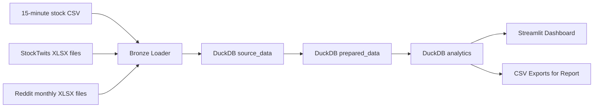

# MarketMood: Stock + Social Sentiment Data Engineering Project

## 1. Problem statement

Looking at stock charts alone only tells part of the story. Looking at Reddit or StockTwits alone does the same. What we wanted was a way to put those two views together: market movement on one side, social mood on the other. This project does that by collecting the raw data, cleaning it, storing it in a simple warehouse, and building a final dashboard that makes the comparison easier to explore.

## 2. Use case

The project is meant to support a simple quantitative-finance workflow where we compare price action with crowd attention and sentiment. The main questions are:

1. Which tickers receive the highest amount of social discussion?
2. How does average daily sentiment compare with same-day return?
3. Does daily sentiment have any relationship with next-day return?
4. Which posts or comments are the strongest positive or negative signals for each ticker?

## 3. Actual datasets collected

### Stock prices

- Source file: `stocks_250101-260319_15m_RAW.csv`
- Granularity: 15-minute OHLCV bars
- Tickers observed: `AAPL`, `AMD`, `GOOG`, `GOOGL`, `META`, `MSFT`, `MU`, `NVDA`
- Total rows: `151,852`

### StockTwits

- Source files: 8 ticker-specific workbooks such as `AAPL_posts.xlsx`, `NVDA_posts.xlsx`
- Raw columns observed: `post_id`, `user`, `time`, `content`
- Total rows: `1,310,301`

### Reddit

- Source files: monthly workbooks from `reddit_2025-08.xlsx` through `reddit_2026-03.xlsx`
- Sheets observed: `Posts`, `Comments`, `Summary`
- Posts rows: `14,658`
- Comments rows: `518,592`

## 4. Why this dataset is practical

- The data was already collected, so we could spend our time on engineering and analysis instead of scraping.
- It combines structured market data with unstructured social text, which makes the integration part meaningful.
- The dataset is large enough to justify layered storage and ETL.
- The structure is consistent enough to build a repeatable pipeline.

## 5. Architecture

## 6. Storage layers

### Raw source layer

The raw files are stored inside the repository so teammates can run the project without having to copy files around manually.

### `source_data`

Purpose:

- keep the source-level structure as intact as possible
- add only light metadata such as source file or source month
- make debugging and re-running the pipeline easier

Tables:

- `source_data.stock_prices_raw`
- `source_data.stocktwits_posts_raw`
- `source_data.reddit_posts_raw`
- `source_data.reddit_comments_raw`
- `source_data.reddit_summary_raw`

### `prepared_data`

Purpose:

- standardize names and data types
- parse timestamps properly
- roll 15-minute stock bars into daily data
- compute sentiment scores from text
- normalize the social data into one common model

Tables:

- `prepared_data.stock_prices_15m`
- `prepared_data.market_daily_prices`
- `prepared_data.stocktwits_posts`
- `prepared_data.reddit_posts`
- `prepared_data.reddit_comments`
- `prepared_data.social_mentions`

### `analytics`

Purpose:

- prepare dashboard-friendly tables
- support findings, comparisons, and correlation analysis

Tables:

- `analytics.daily_social_signals`
- `analytics.daily_market_social`
- `analytics.ticker_overview`
- `analytics.top_social_posts`
- `analytics.dataset_inventory`

## 7. ETL logic

1. Load the stock CSV into `source_data`
2. Load each StockTwits workbook into `source_data` and tag it with its ticker
3. Load each Reddit workbook into `source_data` and tag it with its source month
4. Standardize timestamps and text columns in `prepared_data`
5. Aggregate 15-minute bars into daily stock bars
6. Score text sentiment with VADER
7. Map Reddit keywords and text to tracked tickers
8. Build one unified social-mentions table
9. Aggregate daily social features and join them with daily market data

## 8. Core analytical features

- `daily_return`
- `next_day_return`
- `total_mentions`
- `stocktwits_mentions`
- `reddit_posts`
- `reddit_comments`
- `avg_sentiment`
- `positive_mentions`
- `negative_mentions`
- `unique_authors`

## 9. Data quality rules

- `(ticker, event_timestamp)` should be unique enough for market bars
- daily stock rows should have valid open, high, low, close values
- sentiment scores should stay within `[-1, 1]`
- social rows without inferred ticker should not enter the `analytics` layer
- malformed timestamps should be filtered out during `prepared_data` transformation

## 10. Final application

The Streamlit dashboard lets the team:

- filter by ticker and date
- compare price trend against social activity
- inspect average sentiment by day
- review top positive and negative content
- show warehouse row counts for the project report

## 11. Expected findings

- highly discussed tickers such as NVDA and AAPL will probably dominate the social volume
- sentiment will likely be noisy and only weakly correlated with returns
- social activity volume may be more useful around major events than average sentiment alone

## 12. Future work

- replace lexicon sentiment with FinBERT
- schedule daily incremental updates
- add a feature store for predictive modeling
- split Reddit posts and comments into separate analytics views
- deploy the pipeline and dashboard with Docker
