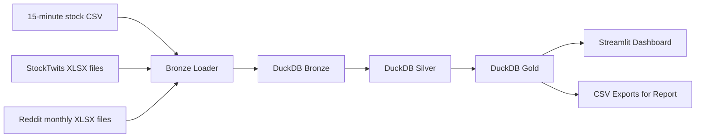

# MarketMood: Stock + Social Sentiment Data Engineering Project

## 1. Problem statement

Price charts alone do not explain why a stock moved. At the same time, raw Reddit and StockTwits posts are noisy and difficult to connect to structured market data. This project solves that gap by building a repeatable data platform that ingests stock prices together with social discussion, standardizes them in a warehouse, derives sentiment features, and serves a curated analytics layer for dashboarding and reporting.

## 2. Use case

The project supports a quantitative-finance style workflow where we want to compare price action with crowd attention and sentiment. The questions are:

1. Which tickers receive the highest amount of social discussion?
2. How does average daily sentiment compare with same-day return?
3. Does daily sentiment have any relationship with next-day return?
4. Which posts or comments are the strongest positive or negative signals for each ticker?

## 3. Actual datasets collected

### Stock prices

- Source file: `stocks_250101-260319_15m_RAW.csv`
- Granularity: 15-minute OHLCV bars
- Tickers observed: `AAPL`, `AMD`, `GOOG`, `GOOGL`, `META`, `MSFT`, `MU`, `NVDA`
- Total rows: `151,852`

### StockTwits

- Source files: 8 ticker-specific workbooks such as `AAPL_posts.xlsx`, `NVDA_posts.xlsx`
- Raw columns observed: `post_id`, `user`, `time`, `content`
- Total rows: `1,310,301`

### Reddit

- Source files: monthly workbooks from `reddit_2025-08.xlsx` through `reddit_2026-03.xlsx`
- Sheets observed: `Posts`, `Comments`, `Summary`
- Posts rows: `14,658`
- Comments rows: `518,592`

## 4. Why this dataset is practical

- It is already collected, so the project can focus on engineering and analytics instead of scraping
- It combines structured market data with unstructured social text
- The scale is large enough to justify layered storage and ETL
- The schema is consistent enough to build a repeatable pipeline

## 5. Architecture

## 6. Storage layers

### Raw source layer

External files remain in their current folders and are referenced through a manifest file. This avoids duplicating large workbooks in the repo while still making the pipeline reproducible.

### Bronze

Purpose:

- preserve source-level structure
- add only minimal metadata such as source file or source month
- support debugging and replay

Tables:

- `bronze.stock_prices_raw`
- `bronze.stocktwits_posts_raw`
- `bronze.reddit_posts_raw`
- `bronze.reddit_comments_raw`
- `bronze.reddit_summary_raw`

### Silver

Purpose:

- standardize column names and data types
- parse timestamps
- derive daily stock bars from 15-minute data
- compute text sentiment
- normalize content into a shared social-mention model

Tables:

- `silver.stock_prices_15m`
- `silver.stock_prices_daily`
- `silver.stocktwits_posts`
- `silver.reddit_posts`
- `silver.reddit_comments`
- `silver.social_mentions`

### Gold

Purpose:

- prepare dashboard-friendly aggregated tables
- support findings and correlation analysis

Tables:

- `gold.daily_social_signals`
- `gold.daily_market_sentiment`
- `gold.ticker_summary`
- `gold.top_social_content`
- `gold.data_inventory`

## 7. ETL logic

1. Load the stock CSV into bronze
2. Load each StockTwits workbook into bronze and tag it with its ticker
3. Load each Reddit workbook into bronze and tag it with its source month
4. Standardize timestamps and text columns in silver
5. Aggregate 15-minute bars into daily stock bars
6. Score text sentiment with VADER
7. Map Reddit keywords and text to tracked tickers
8. Build a unified social-mentions table
9. Aggregate daily social features and join them with daily market data

## 8. Core analytical features

- `daily_return`
- `next_day_return`
- `total_mentions`
- `stocktwits_mentions`
- `reddit_posts`
- `reddit_comments`
- `avg_sentiment`
- `positive_mentions`
- `negative_mentions`
- `unique_authors`

## 9. Data quality rules

- `(ticker, event_timestamp)` should be unique enough for market bars
- daily stock rows should have valid open, high, low, close values
- sentiment scores should stay within `[-1, 1]`
- social rows without inferred ticker should not enter the gold layer
- malformed timestamps should be filtered out during silver transformation

## 10. Final application

The Streamlit application will allow the team to:

- filter by ticker and date
- compare price trend against social activity
- inspect average sentiment by day
- review top positive and negative content
- show warehouse row counts for the project report

## 11. Expected findings

- highly discussed tickers such as NVDA and AAPL will likely dominate the social volume
- sentiment will probably be noisy and only weakly correlated with returns
- social activity volume may be more informative around major events than raw average sentiment alone

## 12. Future work

- replace lexicon sentiment with FinBERT
- schedule daily incremental updates
- add a feature store for predictive modeling
- split Reddit posts and comments into separate gold views
- deploy the pipeline and dashboard with Docker

